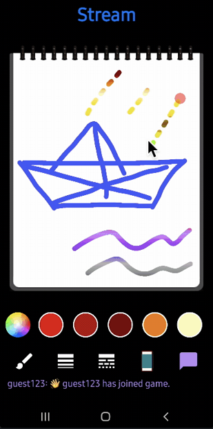
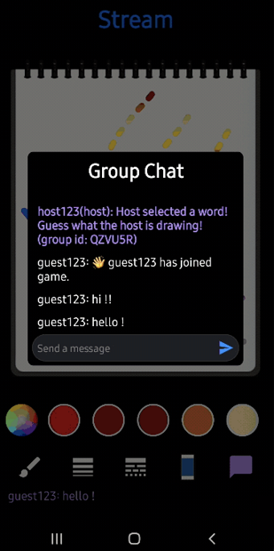
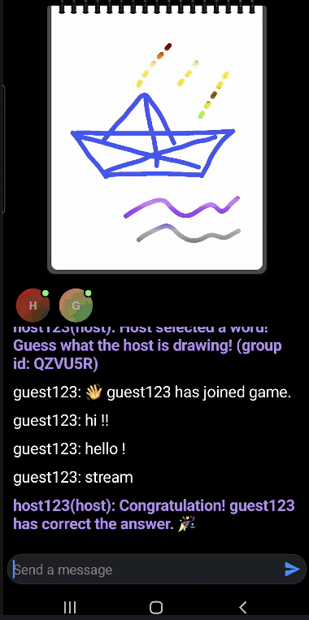

<p align="center">
<a href="https://getstream.io/chat/sdk/android/?utm_source=Github&utm_medium=Github_Repo_Content_Ad&utm_content=Developer&utm_campaign=Github_Mar2022_AndroidSDK&utm_term=DevRelOss">
</a></pr><br><br>

<p align="center">
  <a href="https://opensource.org/licenses/Apache-2.0"></a>
  <a href="https://android-arsenal.com/api?level=21"></a>
  <a href="https://github.com/GetStream/stream-draw-android/actions/workflows/android.yml"></a>
  <a href="https://us12.campaign-archive.com/?u=f39692e245b94f7fb693b6d82&id=64aa6e5e5e"></a>
  <a href="https://androidweekly.net/issues/issue-511"></a>
</p>

<p align="center">  
🛥 Stream Draw is a real-time multiplayer drawing & chat game app built entirely with Jetpack Compose.<br>
Draw and guess words with your friends! This project was inspired by <a href="https://skribbl.io/" target="_blank"> Skribbl.io</a>.
</br></br>

## Previews
<p align="center">

</p>

## Download
Go to the [Releases](https://github.com/GetStream/stream-draw-android/releases) to download the latest APK.

<a href="https://getstream.io/chat/sdk/android/?utm_source=Github&utm_medium=Github_Repo_Content_Ad&utm_content=Developer&utm_campaign=Github_Mar2022_AndroidSDK&utm_term=DevRelOss">

</a>

## 🛥 Stream Chat SDK
Stream Draw was built with __[Android Chat SDK for Messaging](https://getstream.io/chat/sdk/android/?utm_source=Github&utm_medium=Github_Repo_Content_Ad&utm_content=Developer&utm_campaign=Github_Mar2022_AndroidSDK&utm_term=DevRelOss)__ to implement messaging systems.
If you’re interested in adding powerful In-App Messaging to your app, check out the __[Android Chat Messaging Tutorial](https://getstream.io/tutorials/android-chat/?utm_source=Github&utm_medium=Github_Repo_Content_Ad&utm_content=Developer&utm_campaign=Github_Mar2022_AndroidSDK&utm_term=DevRelOss)__!

- [Stream Chat SDK for Android on GitHub](https://github.com/getStream/stream-chat-android)
- [Android Samples for Stream Chat SDK on GitHub](https://github.com/getStream/android-samples)
- [Stream Chat Compose UI Componenets Guidelines](https://getstream.io/chat/docs/sdk/android/compose/overview/)

## 🛠 Tech Stack & Open Source Libraries
- Minimum SDK level 21.
- 100% [Jetpack Compose](https://developer.android.com/jetpack/compose) based + [Coroutines](https://github.com/Kotlin/kotlinx.coroutines) + [Flow](https://kotlin.github.io/kotlinx.coroutines/kotlinx-coroutines-core/kotlinx.coroutines.flow/) for asynchronous.
- [Compose Chat SDK for Messaging](https://getstream.io/chat/compose/tutorial/?utm_source=Github&utm_medium=Github_Repo_Content_Ad&utm_content=Developer&utm_campaign=Github_Mar2022_AndroidSDK&utm_term=DevRelOss) - The Jetpack Compose Chat Messaging SDK is built on a low-level chat client and provides modular, customizable Compose UI components that you can easily drop into your app.
- Jetpack
  - Compose - Android’s modern toolkit for building native UI.
  - Lifecycle - Observe lifecycle changes.
  - ViewModel - UI related data holder and lifecycle aware.
  - App Startup - Provides a straightforward, performant way to initialize components at application startup.
- [Hilt](https://dagger.dev/hilt/) - Dependency Injection.
- [sketchbook-compose](https://github.com/getStream/sketchbook-compose) - Jetpack Compose canvas library that helps you draw paths, images on canvas with color pickers and palettes.
- [landscapist](https://github.com/skydoves/landscapist) - Jetpack Compose image loading library that fetches and displays network images with Glide, Coil, and Fresco.
- [Retrofit2 & OkHttp3](https://github.com/square/retrofit) - Construct the REST APIs and paging network data.
- [Moshi](https://github.com/square/moshi/) - A modern JSON library for Kotlin and Java.
- [Konfetti](https://github.com/DanielMartinus/Konfetti) - Celebrate more with this lightweight confetti particle system.
- [Timber](https://github.com/JakeWharton/timber) - A logger with a small, extensible API which provides utility.

## ✅ Available Features
- Light and Dark themes.
- Creating and joining a group channel.
- Supports host mode and guest mode.
- Welcome and exit messages.
- Fetches a list of words from the network.
- Real-time drawing on the sketchbook.
- Real-time chat messaging with multiple users.
- Real-time participants' list of a connected channel.
- Guessing a word and congratulation animations.
- Single message notification and real-time chat dialog for the host.
- Restarting game by the host.
- Exiting and deleting the channel by the host.
- And a lot of additional features using Stream Chat SDK for Android!

## ☑️ TODO
- [ ] Available channel list.
- [ ] Game rounds.
- [ ] Time limits.

## 💙 Contribution
Anyone can contribute to improving code, docs, or something following our [Contributing Guideline](/CONTRIBUTING.md).

## 📱 Game Screenshots

<p align="center">



</p>

## 💯 MAD Score


 <a href="https://getstream.io/chat/sdk/android/?utm_source=Github&utm_medium=Github_Repo_Content_Ad&utm_content=Developer&utm_campaign=Github_Mar2022_AndroidSDK&utm_term=DevRelOss">
</a>

## Find this repository useful? 💙
Support it by joining __[stargazers](https://github.com/GetStream/stream-draw-android/stargazers)__ for this repository. :star: <br>
Also, follow __[maintainers](https://github.com/GetStream/stream-draw-android/graphs/contributors)__ on GitHub for our next creations! 🤩

# License
```xml
Copyright 2022 Stream.IO, Inc. All Rights Reserved.

Licensed under the Apache License, Version 2.0 (the "License");
you may not use this file except in compliance with the License.
You may obtain a copy of the License at

   http://www.apache.org/licenses/LICENSE-2.0

Unless required by applicable law or agreed to in writing, software
distributed under the License is distributed on an "AS IS" BASIS,
WITHOUT WARRANTIES OR CONDITIONS OF ANY KIND, either express or implied.
See the License for the specific language governing permissions and
limitations under the License.
```
